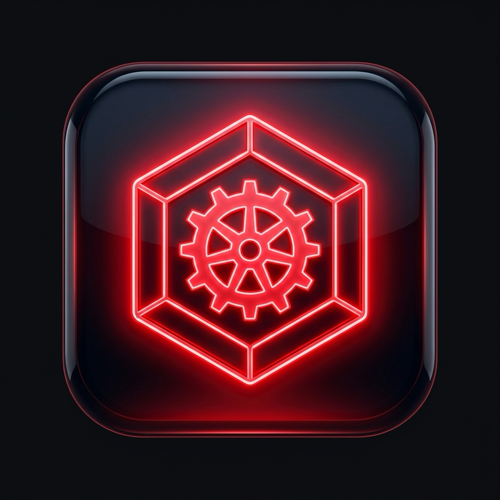
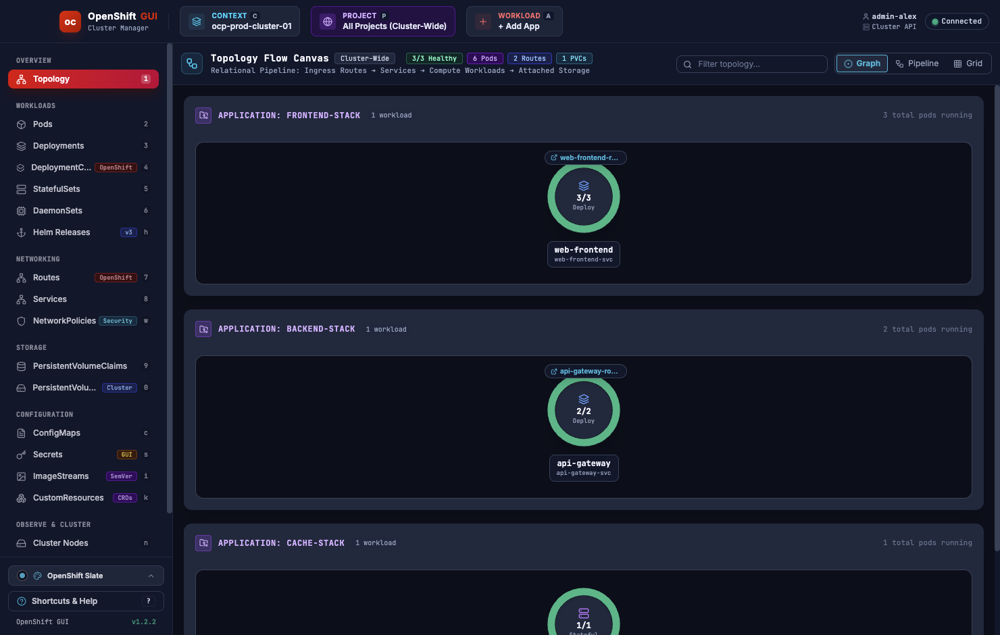
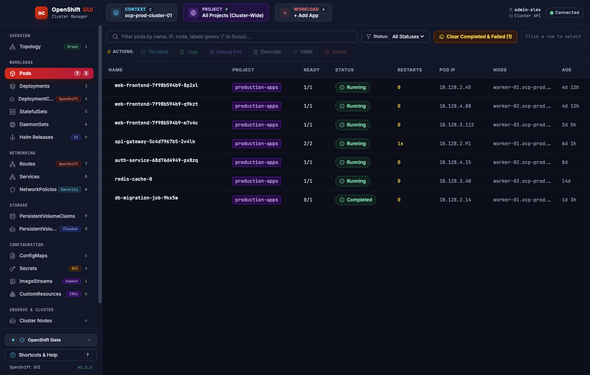
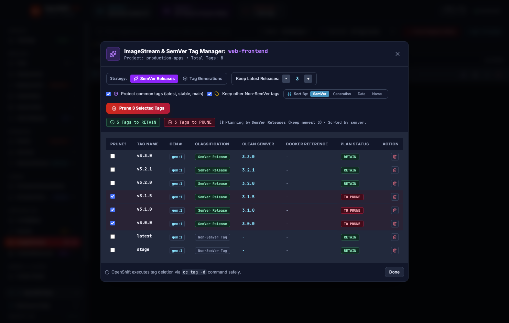
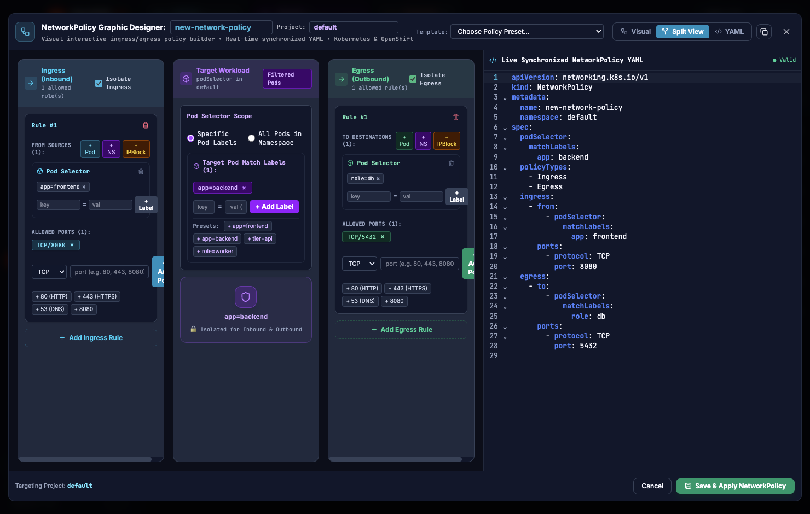
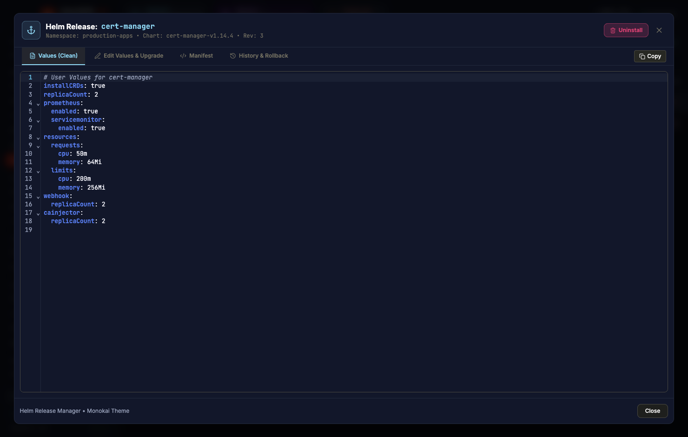
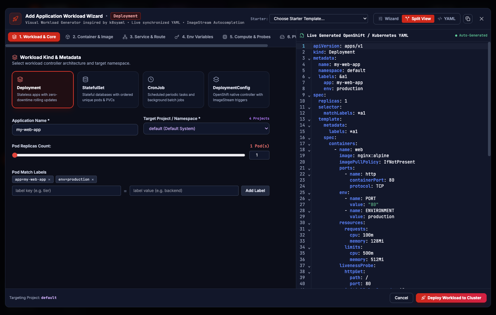
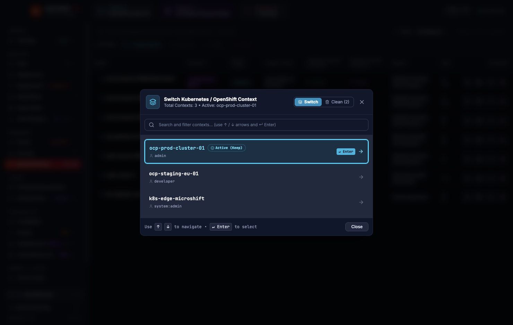

# OpenShift GUI (Desktop Application & CLI)

<div align="center">
  
  <h3>Modern Native Desktop Interface & Terminal CLI for OpenShift and Kubernetes Management</h3>

  <p>
    <a href="#-screenshots--ui-tour">Screenshots</a> •
    <a href="#-key-features">Features</a> •
    <a href="#-quick-start--installation">Installation</a> •
    <a href="#-build--packaging">Build Commands</a> •
    <a href="#-terminal-cli--tui-mode">CLI Mode</a> •
    <a href="#-tech-stack">Tech Stack</a>
  </p>

  <p>
    
    
    
    
    
    
  </p>
</div>

---

A modern, high-performance Graphical Desktop Application (GUI) & Terminal CLI for **OpenShift** and **Kubernetes** cluster operations. Designed with a dark glassmorphism aesthetic, ultra-low latency IPC communication, live resource streaming, interactive visual topology maps, and automated DevOps cleanup wizards.

---

## 📸 Screenshots & UI Tour

### 1. Interactive Workload Topology Canvas
Visual relational map linking Ingress Routes, Services, Compute Workloads (Deployments, StatefulSets, DaemonSets, CronJobs), Pods, and Persistent Storage in real time.

<div align="center">
  
</div>

---

### 2. High-Performance Resource Explorer & Action Suggestions
Live resource filtering by name, status, IP, node, or labels with instant contextual action pills (`Scale Replicas`, `Live Logs`, `Debug Pod`, `Describe`, `YAML Edit`, `Delete`).

<div align="center">
  
</div>

---

### 3. ImageStream & SemVer Tag Cleanup Wizard
Smart image tag parser that sorts tags by true Semantic Versioning (`v3.3.0` > `v3.2.1`), protects stable tags (`latest`, `stable`, `main`), and executes batch tag deletions (`oc tag -d`) safely.

<div align="center">
  
</div>

---

### 4. Visual NetworkPolicy Designer & Live Synchronized YAML
Interactive graphic builder for Kubernetes & OpenShift NetworkPolicies. Add ingress/egress rules, pod/namespace selectors, CIDR IPBlocks, and target ports with live YAML generation and validation.

<div align="center">
  
</div>

---

### 5. Native Helm 3 Release Manager
Full Helm release lifecycle browser. Inspect user values with live syntax highlighting, review rendered manifests, inspect revision histories, and trigger 1-click rollbacks.

<div align="center">
  
</div>

---

### 6. Add Application 6-in-1 Workload Deployment Wizard
Multi-step workload generator for Deployments, StatefulSets, CronJobs, and DeploymentConfigs with container image autocompletion, resource limits, readiness/liveness probes, and environment variables.

<div align="center">
  
</div>

---

### 7. Multi-Cluster Context & Project Switcher
Instant cluster context switching and OpenShift project selection (`oc project`) with fuzzy search and kubeconfig cleanup tools.

<div align="center">
  
</div>

---

## 🌟 Key Features

### 🖥️ Workload & Cluster Management
- **Topology Map Canvas**: Visual relational pipeline connecting Routes → Services → Workloads → Pods → PVCs with live health rings.
- **Fast Fuzzy Resource Search**: Filter pods, deployments, routes, services, secrets, and CRDs instantly with `/` keyboard shortcut.
- **Contextual Action Suggestions**: One-click action pills appear dynamically based on selected resource kind.
- **Live Terminal & Pod Logs**: Interactive `xterm.js` pod shell (`oc exec`) and real-time log streaming with regex filtering and container selector.
- **Node & Pod Debugging**: Launch ephemeral debug containers (`oc debug node/<name>` and `oc debug pod/<name>`) directly from the GUI.

### 🧹 DevOps Automation & Cleanup Wizards
- **SemVer ImageStream Cleaner**: Parses image tags into semantic versions, keeps the latest $N$ releases, and prunes old builds automatically.
- **Registry Blob Pruner**: Generates and executes OpenShift image registry garbage collection (`adm prune images`) and scheduled CronJobs.
- **Kubeconfig Cleaner**: Detects dangling clusters, users, and inactive contexts to keep your `~/.kube/config` clean.
- **Batch Pod Deletion**: Bulk purge `Completed`, `Failed`, or `CrashLoopBackOff` pods with a single click.

### 🛡️ Networking & Security
- **Visual NetworkPolicy Designer**: Create isolate/allow rules for Ingress and Egress traffic with live YAML synchronization.
- **In-Place Secret Editor**: View, decode, modify, and encode Kubernetes Secrets safely without leaving the app.
- **Live PVC Expansion**: Dynamically resize PersistentVolumeClaims on storage classes that support volume expansion.
- **Custom Resource Explorer**: View and edit instances of any installed CustomResourceDefinition (CRD).

---

## 🚀 Quick Start & Installation

### 1. Launch from Source (Development or Local)

```bash
# Clone the repository
git clone https://github.com/adynetro/openshift-gui.git
cd openshift-gui

# Install dependencies
npm install

# Start the Desktop GUI Window
npm run gui
# or
npm start
```

### 2. Launch the Packaged macOS App

```bash
# Open the packaged macOS Application directly
open "release/mac-arm64/OpenShift GUI.app"
```

Or extract `release/OpenShift-GUI-macOS-arm64.zip` into your `/Applications` directory.

---

## 📦 Build & Packaging

| Command | Description |
|---|---|
| `npm run build:gui` | Builds Vite frontend & bundles Electron main/preload scripts |
| `npm run pack:app` | Packages unpacked macOS `.app` bundle in `release/mac-arm64/` |
| `npm run pack:dmg` | Builds macOS `.dmg` installer |
| `npm run pack:zip` | Packages macOS `.zip` distribution archive |
| `npm run pack:win` | Builds Windows executable package |
| `npm run pack:all` | Builds both macOS and Windows distributions |
| `npm run build:mac` | Builds standalone native CLI binary using Node SEA |
| `npm test` | Runs the test suite |

---

## 📟 Terminal CLI / TUI Mode

`openshift-gui` can also be launched directly inside any terminal as an interactive CLI / TUI:

```bash
# Run CLI mode
node bin/openshift-gui.js

# Or globally link
npm link
openshift-gui
```

---

## 🛠 Tech Stack

- **Runtime**: [Electron 43](https://www.electronjs.org/) + Node.js 20+
- **Frontend**: [React 18.3](https://react.dev/), [TypeScript 5.7](https://www.typescriptlang.org/), [Vite 6](https://vitejs.dev/)
- **Styling**: [Tailwind CSS v4](https://tailwindcss.com/), [Lucide Icons](https://lucide.dev/)
- **Code & Terminal Components**: [CodeMirror 6](https://codemirror.net/), [xterm.js](https://xtermjs.org/)
- **TUI & CLI Engine**: [Ink](https://github.com/vadimdemedes/ink), [Commander](https://github.com/tj/commander.js), [Chalk](https://github.com/chalk/chalk)
- **Cluster Integrations**: `oc`, `kubectl`, `helm 3`

---

## 📄 License

This project is licensed under the [MIT License](LICENSE).
